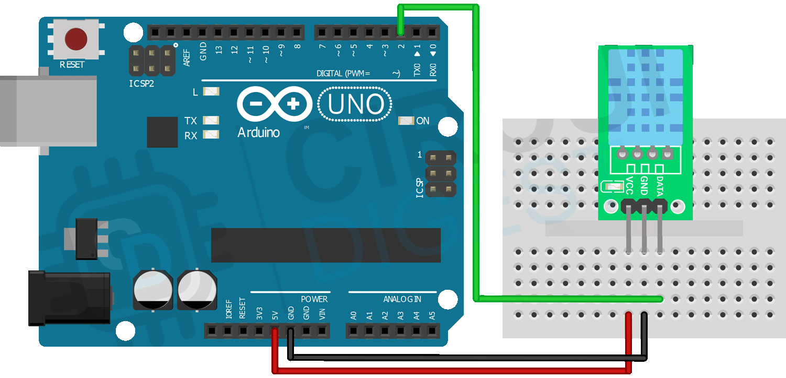

Our atmospheric sensor is called DHT11, and it measures temperature and humidity. You can read this data using an Arduino. 

# Hardware
- DHT11 Sensor
- Arduino
- Jumper Wires

# Circuit
Connect the DHT11 sensor to the Arduino as shown in the diagram. Here is a table of the connections for your reference:

| DHT11 Sensor | Arduino |
| --- | --- |
| VCC | 5V |
| GND | GND |
| OUT | Digital Pin 2 |



You're free to use any digital pin for the OUT pin, from 2 to 12. Just make sure to update the pin number in the code, as shown below in the `void setup()` function.

```cpp
void setup() {
    initializeDHT11Sensor(2);  // Initialize the DHT11 sensor on digital pin 2
}
```

Make sure to install and include the DHT library in your Arduino IDE. You can find the library at: https://github.com/adidax/dht11.git

### Code to include the library
```cpp
#include <DHT.h>
```