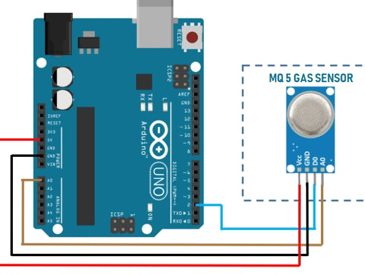

A gas sensor is a device that detects the concentration of a specific gas in the air. The sensor also has an adjustable threshold that can be used to detect the presence of a gas within a certain range. However, we'll simply get the concentration of the gas in the air.

Note that there are multiple types of gas sensors, each designed to detect a specific gas. This same code and connection can be used for all the gas sensors.

We have the following sensors, and their respective gases:
- MQ-3: Alcohol, Ethanol, Smoke
- MQ-8: Hydrogen Gas
- MQ-135: Air Quality (Ammonia, Benzene, Smoke, CO2)

# Hardware
- Gas Sensor
- Arduino
- Jumper Wires

# Circuit
Connect the gas sensor to the Arduino as shown in the diagram. Here is a table of the connections for your reference:

| Gas Sensor | Arduino |
| --- | --- |
| VCC | 5V |
| GND | GND |
| OUT | Analog Pin A0 |



You're free to use any analog pin for the OUT pin, from A0 to A5. Just make sure to update the pin number in the code, as shown below in the `void setup()` function.

```cpp
void setup() {
    initializeGasSensor(A0);  // Initialize the gas sensor on analog pin A0
}
```