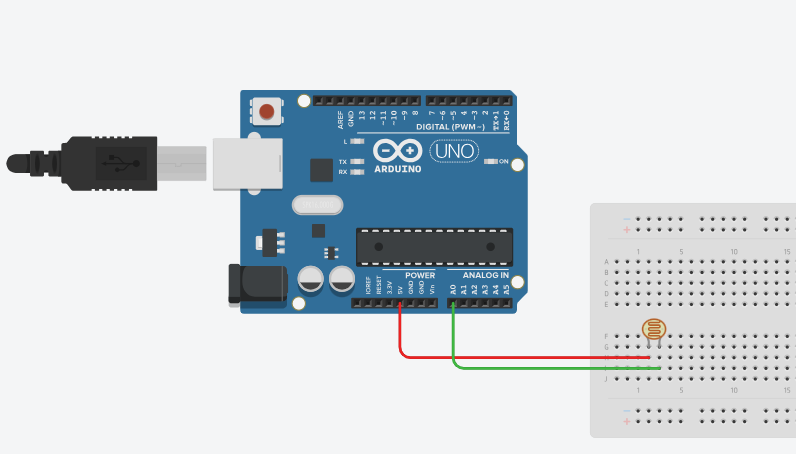

An LDR (light dependent resistor) is a sensor that measures the amount of light in its environment. The sensor has a resistance that changes with the amount of light it is exposed to. The sensor can be used to detect the presence of light, or to measure the amount of light in a certain area.

# Hardware
- LDR Sensor
- Arduino
- Jumper Wires

# Circuit
Connect the LDR sensor to the Arduino as shown in the diagram. Here is a table of the connections for your reference:

| LDR Sensor | Arduino |
| --- | --- |
| VCC | 5V |
| GND | GND |
| OUT | Analog Pin A0 |



You're free to use any analog pin for the OUT pin, from A0 to A5. Just make sure to update the pin number in the code, as shown below in the `void setup()` function.

```cpp
void setup() {
    initializeLDRSensor(A0);  // Initialize the LDR sensor on analog pin A0
}
```