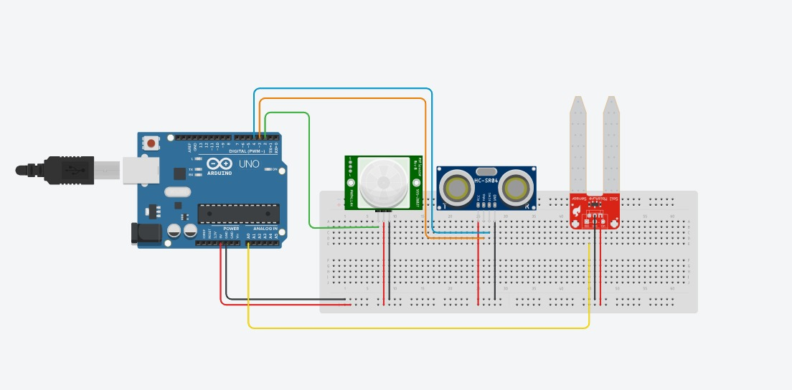

We've prepared a sensor array as well, with these sensors:
*   PIR motion sensor
*   Ultrasonic distance sensor
*   Soil moisture sensor

# Hardware
- PIR Motion Sensor
- Ultrasonic Distance Sensor HC-SR04
- Soil Moisture Sensor
- Arduino
- Jumper Wires
- Breadboard

# Circuit
Connect the sensors to the Arduino as shown in the diagram. Here is a table of the connections for your reference:

| Sensor | Arduino |
| --- | --- |
| PIR Motion Sensor OUT | Digital Pin 2 |
| Ultrasonic Distance Sensor (Echo) | Digital Pin 3 |
| Ultrasonic Distance Sensor (Trig) | Digital Pin 4 |
| Soil Moisture Sensor OUT | Analog Pin A0 |
| VCC (of all sensors) | 5V |
| GND (of all sensors) | GND |



You're free to use any digital pin for the all the sensors, from 2 to 12, and any analog pin for the soil moisture sensor. Just make sure to update the pin numbers in the code, as shown below in the `void setup()` function.

```cpp
void setup() {
    initializePIRSensor(2);  // Initialize the PIR sensor on digital pin 2
    initializeUltrasonicSensor(3, 4);  // Initialize the ultrasonic sensor on digital pins 3 and 4
    initializeSoilMoistureSensor(A0);  // Initialize the soil moisture sensor on analog pin A0
}
```