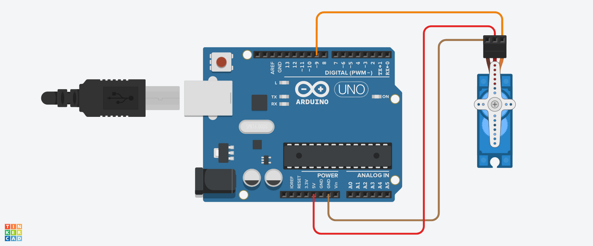

The Micro Servo is a compact motor widely used in robotics and electronics to provide precise control of movement. It typically features a lightweight design, operates on low voltage, and is ideal for small-scale applications like RC vehicles, robotic arms, or hobby projects. The Micro Servo motors available to us move in the range 0° to 180°

# Hardware

- Micro Servo Motor
- Arduino
- Jumper Wires

# Circuit

Connect the micro-servo motor to the Arduino as shown in the diagram. Here is a table of the connections for your reference:

|  Micro-Servo | Wire Color | Arduino |
| --- | --- | --- |
| Power | Red | 5V |
| Ground | Brown | GND |
| Signal | Orange | 9 |



You can use any digital pin to run the Micro Servo motor. Just make sure to update the pin number in the code, as shown below in the `void setup()` function.

```cpp
void setup() {
    initializeServoMotor(9); // Initialize the servo on digital pin 9
}
```