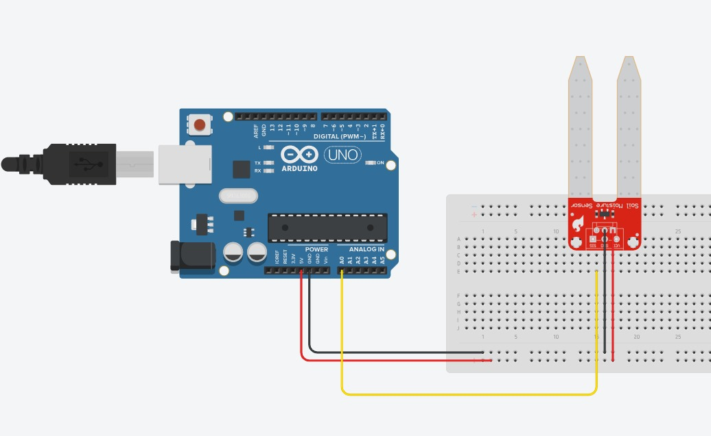

A soil moisture sensor uses a pair of electrodes to measure the volumetric water content of the soil. The sensor has an adjustable threshold that can be used to detect the moisture level within a certain range. The sensor can be used to detect the presence of moisture in the soil, or to measure the moisture level in a certain area.

# Hardware
- Soil Moisture Sensor probes
- Soil Moisture Sensor module
- Arduino
- Jumper Wires

# Circuit
Connect the soil moisture sensor to the Arduino as shown in the diagram. This diagram doesn't show it, but you need to connect the module to the sensor separately. Here is a table of the connections for your reference:

| Soil Moisture Sensor Module | Arduino |
| --- | --- |
| VCC | 5V |
| GND | GND |
| A0 | Analog Pin A0 |

| Module | Probe |
| --- | --- |
| VCC | VCC |
| GND | GND |



You're free to use any analog pin for the A0 pin. Just make sure to update the pin number in the code, as shown below in the `void setup()` function.

```cpp
void setup() {
    initializeSoilMoistureSensor(A0);  // Initialize the soil moisture sensor on analog pin A0
}
```