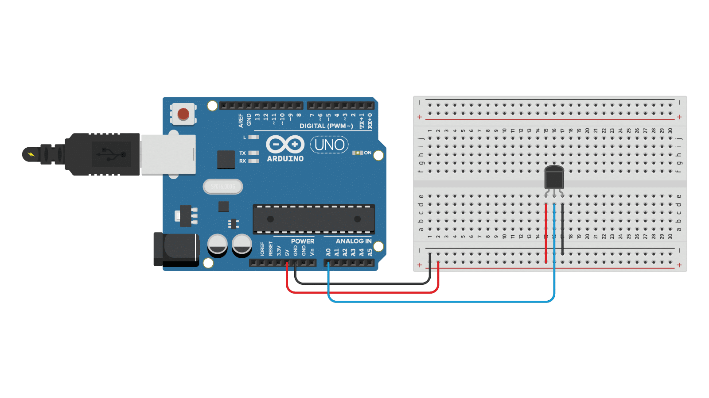

Our temperature sensor is called LM35. It is a precision integrated-circuit temperature sensor, whose output voltage is linearly proportional to the Celsius temperature. It measures temperatures from 0°C to 100°C.

# Hardware
- LM35 Temperature Sensor
- Arduino
- Jumper Wires

# Circuit
Connect the temperature sensor to the Arduino as shown in the diagram. Here is a table of the connections for your reference:

| LM35 | Arduino |
| --- | --- |
| VCC | 5V |
| GND | GND |
| OUT | Analog Pin A0 |



You're free to use any analog pin for the OUT pin, from A0 to A5. Just make sure to update the pin number in the code, as shown below in the `void setup()` function.

```cpp
void setup() {
    initializeTemperatureSensor(A0);  // Initialize the temperature sensor on analog pin A0
}
```