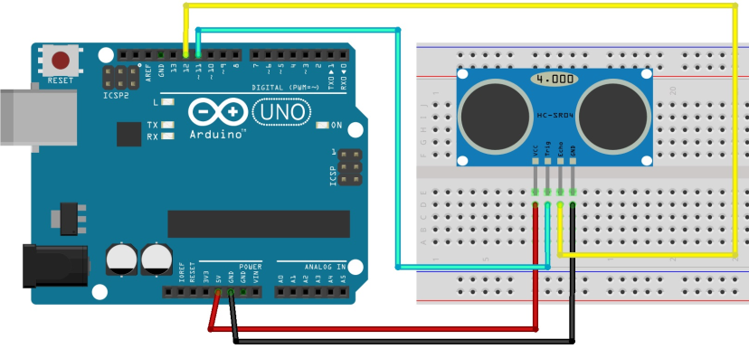

Our ultrasound sensor is called HC-SR04. It is a sensor that measures the distance from an object by emitting an ultrasound and measuring the time it takes for the sound to reflect back to the sensor. The sensor has an adjustable threshold that can be used to detect objects within a certain range. The sensor can be used to detect objects in front of it, or to detect the presence of an object in a certain area.

# Hardware
- HC-SR04 Ultrasound Sensor
- Arduino
- Jumper Wires

# Circuit
Connect the ultrasound sensor to the Arduino as shown in the diagram. Here is a table of the connections for your reference:

| Ultrasound Sensor | Arduino |
| --- | --- |
| VCC | 5V |
| GND | GND |
| TRIG | Digital Pin 11 |
| ECHO | Digital Pin 12 |



You're free to use any digital pin for the TRIG and ECHO pins, from 2 to 12. Just make sure to update the pin numbers in the code, as shown below in the `void setup()` function.

```cpp
void setup() {
    initializeUltrasoundSensor(11, 12);  // Initialize the ultrasound sensor on digital pins 11 and 12
}
```